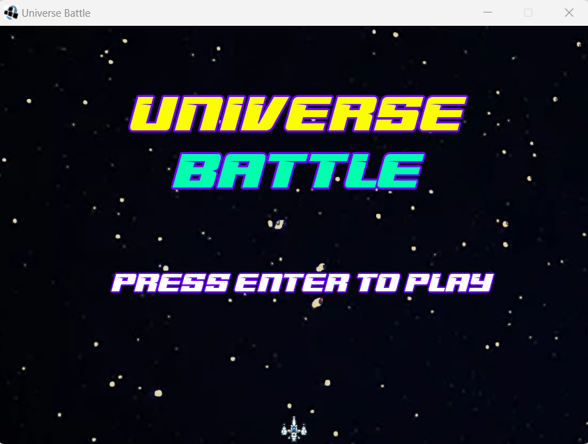
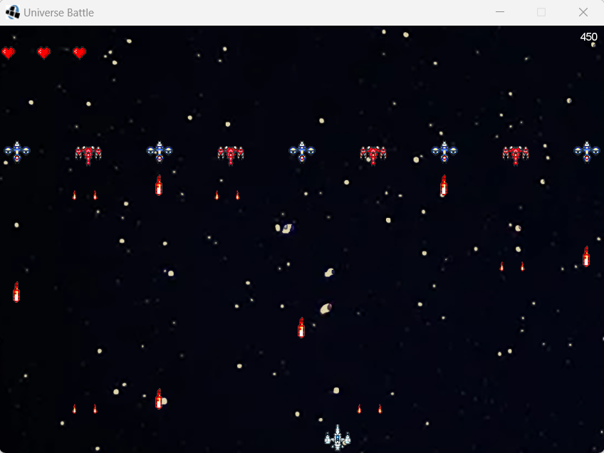
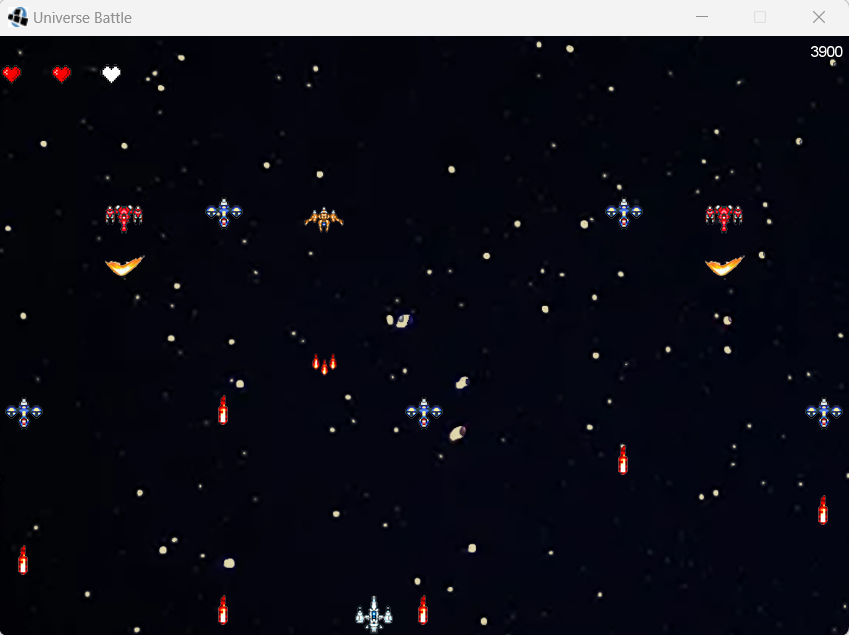
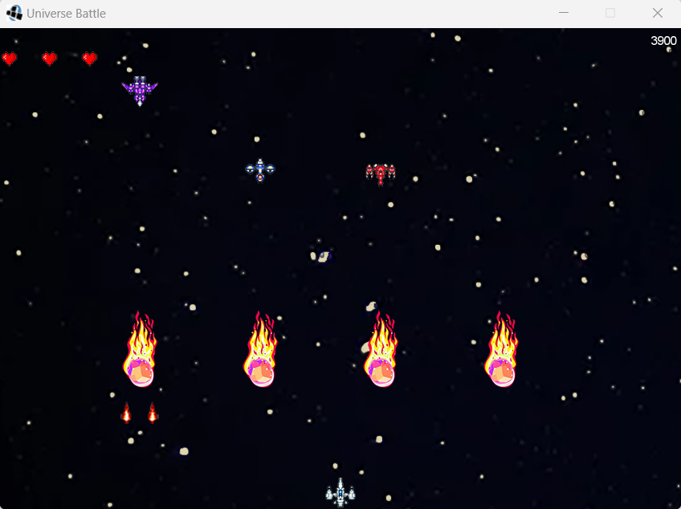

# Universe Battle

## Equipo de Desarrollo: PdePelados

- Nicolás Ariel Molina
- Juan Ignacio Bencardino
- Agustín Neustadt
- Juan Furlan

## Capturas del Videojuego

## Reglas del Juego / Instrucciones

### Objetivo
Eliminar a todos los enemigos que aparezcan en el radar y evitar recibir sus disparos.

### Controles
#### Movimiento
- Flecha Derecha: La nave se mueve hacia la derecha.
- Flecha Izquierda: La nave se mueve hacia la izquierda.
- Espacio: La nave ejecuta un disparo.

## Otros

- Facultad: UTN Regional Buenos Aires
- Curso: K2005
- Versión de Wollok: 3.0.0
- Una vez terminado, no tenemos problemas en que el repositorio sea público.
